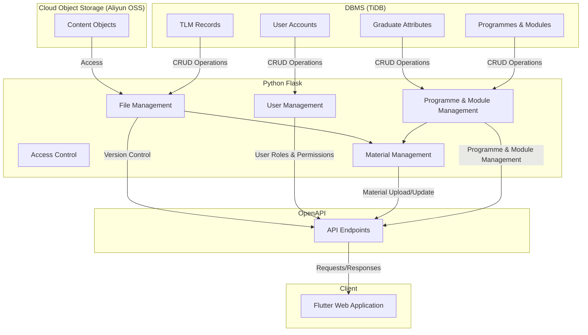
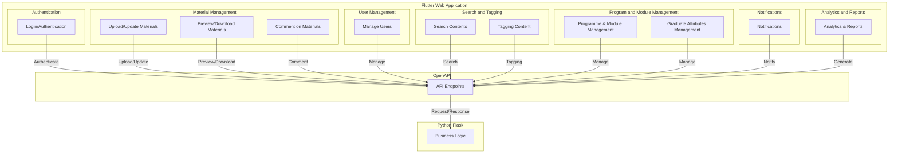

## Usage

### Python Environment

Setup the Python development environment when you pull the repo.
```
cd backend
python -m venv venv 
source venv/bin/activate
(venv) pip install -r requirements.txt
(venv) flask db init
(venv) python dummy_data.py
(venv) flask run
```
Visit `http://127.0.0.1:5000/apidocs` to read the OpenAPI Documentation.

After you finished testing, terminate the Flask runtime and 
```
(venv) deactivate
```

### Redis

```
docker pull redis
docker run --name redis-dev -p 6379:6379 -d redis
```

Then `cd` to the `backend` directory and run
```
celery -A app.celery_worker:celery worker --loglevel=info
```

This will make the celery worker activated.


## Intoduction to CITOBE

### Aim

To develop a file management system for University Teaching and Learning. Typically, a teacher (staff) use this system to upload his/her teaching/learning materials (TLMs), of different file types, or preview and download contents from the system. An auditor is a person who is authorised to inspect the TLMs and make suggestion to teachers. The system should be well designed to categorise variant TLMs of different modules (courses) and different staffs. 

### Feature

1. Search contents *
   - Fulltext search engine
   - Sorting
2. File and Folder
   - Version control
   - File type: doc/docx, xls/xlsx, ppt/pptx, pdf/ps, jpg/gif/png/svg, mp3/ogg, mp4/ogv, etc
   - Tagging content, and auto-tagging *
3. Manage graduate attributes/programmes/modules
   - Visualise a suppring matrix of modules and graduate attributes
   - Edit corresponding among graduate attributes and programmes and modules *
4. Manage materials
   - Upload/Update materials
   - Preview/Download materials
   - Comment on materials *
5. Manage users
   - Roles: admin/staff/auditor/guest
6. Access control
7. Notification *
8. Analytics and reports *
   - ChatGPT API

Features with * is in low priority.

### Tech

- Use cloud object storage service as an file system infrastucture, e.g. Aliyun OSS or AWS S3.
- Python Flask is emplyed as business logic layer.
- Flutter, as a frontend, is a powerful framework for multi-platform development.
- OpenAPI-based APIs are well designed for requesting resources.
- DBMS can be either MySQL or TiDB.





### API Endpoints

Updated on 2023-11-06


#### Authentication:

- `POST /auth/login`: Authenticate a user
- `POST /auth/logout`: Log out a user
- `POST /auth/register`: Register a new user
- `PUT /auth/password`: Update a user's password

#### User Management:

- `POST /users`: Create a new user
- `PUT /users/{user_id}`: Update an existing user
- `GET /users/{user_id}`: Get a specific user
- `DELETE /users/{user_id}`: Delete a specific user
- `GET /users`: List/search users

#### Material Management:

- `POST /materials`: Upload a new material
- `PUT /materials/{materialId}`: Update an existing material
- `GET /materials/{materialId}`: Get a specific material
- `DELETE /materials/{materialId}`: Delete a specific material
- `GET /materials`: List/search materials

#### Search and Tagging:

- `GET /search`: Search contents
- `POST /tags`: Create a new tag
- `PUT /tags/{tagId}`: Update an existing tag
- `DELETE /tags/{tagId}`: Delete a specific tag

#### Program Management:

- `POST /programs`: Create a new program
- `PUT /programs/{program_id}`: Update an existing program
- `DELETE /programs/{program_id}`: Delete a specific program
- `GET /programs`: List/search programs, with optional query parameters `name` and `version`

#### Module Management:

- `POST /modules`: Create a new module
- `PUT /modules/{moduleId}`: Update an existing module
- `DELETE /modules/{moduleId}`: Delete a specific module
- `GET /modules`: List/search modules

#### Graduate Attribute Management:

- `POST /graduate-attributes`: Create a new graduate attribute
- `PUT /graduate-attributes/{attribute_id}`: Update an existing graduate attribute
- `DELETE /graduate-attributes/{attribute_id}`: Delete a specific graduate attribute
- `GET /attributes?{program_id,name}`: List all attributes, with optional query parameters `program_id` and `name`

#### Objective Management:

- `POST /objectives`: Create a new objective
- `PUT /objectives/{objective_id}`: Update an existing objective
- `GET /objectives/{objective_id}`: Get a specific objective
- `DELETE /objectives/{objective_id}`: Delete a specific objective
- `GET /objectives?{program_id,name}`: List all objectives, with optional query parameters `program_id` and `name`

#### Notifications:

- `POST /notifications`: Create a new notification
- `GET /notifications`: List/search notifications

#### Analytics and Reports:

- `GET /analytics`: Retrieve analytics data
- `GET /reports`: Generate/retrieve reports

#### Comments on Materials:

- `POST /materials/{materialId}/comments`: Create a new comment on a material
- `PUT /materials/{materialId}/comments/{commentId}`: Update an existing comment
- `DELETE /materials/{materialId}/comments/{commentId}`: Delete a specific comment
- `GET /materials/{materialId}/comments`: List comments on a material

### Database design

https://dbdiagram.io/d/citobe-653eee97ffbf5169f0b01809

### UI design

1. **Authentication Pages**:
   - Login Page
   - Registration Page
   - Forgot Password Page
2. **Dashboard**:
   - Overview Page (showing a summary of materials, users, notifications, etc.)
3. **Material Management**:
   - Material Listing Page (listing all materials with **search** and **filter** options)
   - Material Creation Page (with **tagging**)
   - Material Update Page (with **tagging**)
   - Material Detail Page (for **previewing** and **downloading** materials)
4. **User Management** (Admin only):
   - User Listing Page (listing all users with **search** and **filter** options)
   - User Creation Page
   - User Update Page
   - User Detail Page
5. **Search and Tagging**:
   - Search Results Page
   - Tag Management Page (for creating, updating, and deleting tags, admin only)
6. **Program and Module Management**:
   - Program Listing Page (listing all programs with **search** and **filter** options)
   - Program Creation Page
   - Program Update Page
   - Program Detail Page
   - Module Listing Page (listing all modules with **search** and **filter** options)
   - Module Creation Page
   - Module Update Page
   - Module Detail Page
7. **Graduate Attributes Management**:
   - Graduate Attribute Listing Page (listing all attributes with **search** and **filter** options)
   - Graduate Attribute Creation Page
   - Graduate Attribute Update Page
   - Graduate Attribute Detail Page
8. **Comments**:
   - Comments Section (part of Material Detail Page)
9. **Notifications**:
   - Notification Listing Page (listing all notifications)
   - Notification Detail Page
10. **Analytics and Reports** (Admin only):
    - Analytics Page (showing various analytics)
    - Reports Page (listing and generating reports)
11. **Settings**:
    - Profile Settings Page (for updating user profile information)
    - System Settings Page (for configuring system-wide settings, admin only)
12. **Help and Documentation**:
    - Help Page (with FAQs, guides, etc.)
    - Documentation Page (with system documentation)
13. **404 Page**:
    - A page to handle un-found routes or pages
# BlogApp
